# Workflow: AIOps — раннее обнаружение и передача навыка в Ops-слой

Тот же навык, другой вход: не «разбери этот дамп», а «смотри на поток».
Отдельного продукта не появляется — меняется только источник и триггер.

```mermaid
flowchart LR
    subgraph S["Источники — контракт resolve()"]
        S1["файлы / zip / .gz"]
        S2["kubectl logs, events"]
        S3["journalctl"]
        S4["Loki / Elasticsearch / Grafana<br/>готовые MCP-серверы, 0 строк кода"]
    end
    S --> T["Окно наблюдения<br/>resolve(spec, window) → локальные байты"]
    T --> U["Дешёвый детектор без LLM<br/>новый шаблон ошибки, всплеск частоты,<br/>редкая строка"]
    U --> V{Сигнал?}
    V -->|нет| U
    V -->|да| W["Совпадение с карточками<br/>knowledge/patterns/"]
    W --> X{Известный паттерн?}
    X -->|да| Y["Быстрый вердикт + готовое действие<br/>это и есть ускорение от обучения"]
    X -->|нет| Z["Полный разбор Sherlock<br/>карта → сужение → корреляция → улики"]
    Y --> AA["Оповещение дежурному<br/>с уликами файл:строка"]
    Z --> AA
    AA --> AB{Дежурный подтверждает?}
    AB -->|да, и это новое| AC["Предложить карточку паттерна"]
    AB -->|ложное срабатывание| AD["Записать как отклонённое,<br/>больше не предлагать так же"]
    AC --> AE["knowledge/patterns/*.md"]
    AD --> AE

    style Y fill:#1f4d2e,color:#fff
    style AE fill:#1f3a5f,color:#fff
    style S4 fill:#3a2a5f,color:#fff
```

**Что здесь важно для расширяемости (R4).** Добавить Elasticsearch, Loki или
Grafana — это запись в конфиге, а не код: под них уже существуют MCP-серверы,
а наш runtime и есть MCP-клиент. Ядро при этом не трогается: всё, что ниже
`resolve()`, видит просто локальный каталог.

**Что здесь важно для обучения (R5).** Ветка «известный паттерн → быстрый
вердикт» — это и есть измеримое ускорение: инцидент №2 того же типа не проходит
полный разбор. Отклонённые срабатывания сохраняются наравне с подтверждёнными,
иначе система будет предлагать одну и ту же ошибку каждую ночь.

**Чего здесь сознательно нет.** Своего хранилища и своего языка запросов. Это
названный анти-паттерн: Loki, Elastic, Kusto и Kubernetes уже имеют MCP-серверы,
и переписывать их ингест — самый дорогой способ ничего не выиграть.
