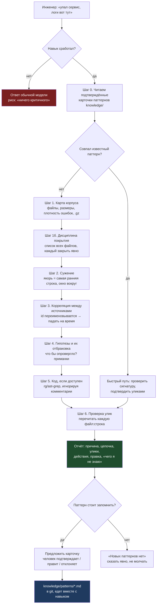

# Workflow: Sherlock — разбор инцидента по логам (offline)

Режим «разработчик/тестировщик просит разобрать». Запускается словами человека,
никаких команд запоминать не нужно.

**Почему шаг 6 обязателен.** Выдуманная улика дороже отсутствующей: она стоит
инженеру часа работы. Утверждение без подтверждённой строки удаляется из отчёта.

**Почему шаг 1б — главный.** Замерено: на одном корпусе и одной модели результат
менялся 100 % → 73 % → 18 % только из-за того, какие файлы агент открыл. Худший
прогон был самым аккуратным в вычислениях — он просто не открыл 12 файлов из 28.

**Где человек в контуре.** Единственная точка — подтверждение карточки. Всё
остальное агент делает сам; карточка без подтверждения не сохраняется никогда.
