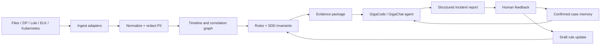

# Исследование решения кейса анализа логов

Дата исследования: 28 июля 2026 года.

Исходные требования: [`task.md`](task.md).

## 1. Резюме

Для задачи рекомендуется гибридный evidence-first агент:

- детерминированные компоненты собирают, нормализуют, маскируют и
  коррелируют логи, traces, Kafka events и метрики;
- версионируемые правила обнаруживают известные сигнатуры и нарушения
  SDD-инвариантов;
- LLM получает не весь необработанный архив, а ограниченный evidence package,
  ранжирует гипотезы и формирует понятное объяснение;
- человек подтверждает или корректирует RCA;
- knowledge layer сохраняет подтверждённый кейс и использует его при
  последующих инцидентах.

Такой подход лучше полностью LLM-driven решения по воспроизводимости,
наблюдаемости, тестируемости, стоимости и контролю ложных RCA.

Рекомендуемый MVP:

1. CLI и локальный stdio MCP.
2. File/ZIP ingest с поддержкой JSONL, JSON, TXT, traces и Prometheus text.
3. Единая схема событий, близкая к OpenTelemetry Log Data Model.
4. Корреляция по trace/correlation/domain identifiers.
5. Rules engine с sequence, window, metric и invariant predicates.
6. Evidence graph и структурированный incident report.
7. SQLite knowledge layer: fingerprints + FTS5/BM25.
8. Human feedback loop с состояниями `proposed`, `confirmed`, `rejected`.
9. Потоковый replay для демонстрации AIOps.
10. Blind benchmark без подсказок, присутствующих в исходном pet-project.

## 2. Интерпретация требований

Нужно разработать не один анализатор, а связанный комплект расширений
GigaCode/core-agent:

- `SKILL.md` с процедурой диагностики;
- MCP/tools для источников логов, traces, репозитория, стенда и knowledge
  layer;
- каталог правил классификации и триггеров;
- Sherlock workflow для on-demand расследования;
- AIOps workflow для near-real-time обнаружения;
- human feedback loop;
- демонстрационные сценарии и измеримый benchmark.

Предлагаемая граница ответственности:

- tools получают факты и выполняют детерминированные операции;
- rules детектируют известные паттерны;
- агент строит объяснение и предлагает действия;
- человек принимает решение о подтверждении RCA и сохранении знания;
- активные правила изменяются только после ревью.



## 3. Анализ демонстрационного инцидента

### 3.1. Цепочка событий

Для correlation ID
`c-8f3a2b91-4d7c-11ee-b962-0242ac120002` наблюдается следующая цепочка:

1. `11:22:03.402Z`: платёж переходит в `AUTHORIZED`.
2. `11:22:03.421Z`: начинается вызов `inventory.reserve` с таймаутом 2000 ms.
3. `11:22:05.423Z`: клиент получает `SocketTimeoutException` через 2001 ms.
4. `11:22:05.425Z`: `order-service` трактует timeout как терминальную ошибку.
5. Заказ переходит `INVENTORY_PENDING → FAILED`.
6. `11:22:05.812Z`: inventory получает row lock после ожидания 2384 ms.
7. `11:22:05.915Z`: inventory создаёт reservation после отключения клиента.
8. Возникает рассинхрон: payment `AUTHORIZED`, order `FAILED`, inventory
   reservation создан.
9. Reconciliation job позднее фиксирует `INV-002`.

### 3.2. Уровни причин

Триггер:

- деградация `inventory-service`;
- DB pool `49/50`;
- p95 inventory `2.870s`;
- ожидание row lock `2.384s`;
- клиентский timeout `2s`.

Корневой дефект бизнес-логики:

- блок `catch (ReservationTimeoutException)` в
  [`OrderCheckoutService.java`](petstore_input_pack/repo/services/order-service/src/main/java/com/petstore/order/svc/OrderCheckoutService.java)
  переводит заказ в `FAILED`;
- нарушается SDD-инвариант И-1 из
  [`sdd_excerpt.md`](petstore_input_pack/docs/sdd_excerpt.md).

Системные факторы:

- результат timeout неоднозначен: сервер может завершить reserve после
  отключения клиента;
- повторный неидемпотентный reserve способен создать двойное резервирование;
- компенсирующая операция payment release не реализована;
- нет durable retry и обработки позднего `InventoryReserved`;
- текущая модель `CheckoutResult` не выражает pending outcome.

### 3.3. Рекомендуемое исправление

Минимальная логика:

- при `ReservationTimeoutException` устанавливать `PENDING_RETRY`;
- сохранять состояние до постановки retry;
- планировать retry через 5 секунд;
- использовать exponential backoff с jitter и максимумом попыток;
- `InventoryUnavailableException` и `OutOfStockException` оставлять
  терминальными;
- после исчерпания retry выполнять payment compensation.

Production-safe вариант дополнительно требует:

- idempotency key для `inventory.reserve`, например `order_id`;
- возврата того же reservation при повторном запросе;
- сверки с поздним `InventoryReserved`;
- transactional outbox или другой durable механизм постановки retry;
- защиты от retry storm;
- отдельного API-ответа для `PENDING_RETRY`;
- метрик количества pending, exhausted retries и orphan reservations.

### 3.4. Второй инцидент

В
[`notification-service/app/main.py`](petstore_input_pack/repo/services/notification-service/app/main.py)
consumer коммитит Kafka offset до успешной отправки email.

Это даёт at-most-once поведение: при SMTP timeout сообщение уже считается
обработанным и теряется.

Исправление:

- commit offset после успешной доставки;
- retry с backoff;
- DLQ после исчерпания retry;
- идемпотентность отправки по `event_id` или комбинации
  `order_id + notification_type`;
- метрики retry, DLQ и duplicate suppression.

## 4. Целевая архитектура

### 4.1. Ingest adapters

Необходимые адаптеры:

- `file`: JSONL, JSON, TXT, multiline stack traces;
- `archive`: ZIP;
- `loki`: range queries;
- `elastic`: search API;
- `kubernetes`: `kubectl logs`;
- `kafka_dump`: JSONL Kafka events;
- `trace`: OTLP/Jaeger-like JSON;
- `prometheus_text`: metrics snapshots;
- `sdd`: Markdown/текстовые архитектурные документы.

File ingest должен:

- определять формат по содержимому, а не только расширению;
- сохранять ссылку на исходный файл и номер строки;
- не удалять необработанное значение;
- поддерживать частично повреждённые файлы;
- присваивать `parse_quality` и фиксировать parse errors отдельно;
- ограничивать размер одного record и общего входа.

ZIP ingest должен защищаться от:

- path traversal;
- абсолютных путей;
- symlinks;
- слишком большого числа файлов;
- ZIP bomb;
- слишком большого uncompressed size;
- повторного перезаписывания файлов.

### 4.2. Единая схема

Рекомендуемая внутренняя схема:

```text
record_id
timestamp
observed_timestamp
severity_text
severity_number
body
event_name
resource.service.name
trace_id
span_id
correlation_id
domain_ids
attributes
source.type
source.ref
source.line
parse_quality
redaction_applied
```

Требуемые задачей поля:

```text
{ts, service, level, correlation_id, order_id, msg, attrs}
```

должны быть проекцией полной схемы, а не единственным хранимым форматом.

### 4.3. Маскирование

PII и secrets удаляются до:

- сохранения в analysis store;
- передачи в LLM;
- включения в MCP response;
- записи audit log.

Минимальные классы:

- email;
- телефон;
- PAN/payment card;
- access/refresh tokens;
- authorization headers;
- passwords;
- cookie/session identifiers;
- приватные ключи;
- configurable domain identifiers.

Полезно хранить тип маскирования и необратимый keyed hash там, где требуется
корреляция одного пользователя между событиями.

### 4.4. Корреляция

Порядок доверия:

1. `trace_id` + `span_id`;
2. `correlation_id`;
3. доменные идентификаторы (`order_id`, Kafka key);
4. service topology + bounded time window;
5. log template;
6. semantic similarity.

Связи ниже третьего уровня должны содержать confidence и объяснение.

Коррелятор строит:

- отсортированную timeline;
- parent/child trace relationships;
- sync dependency calls;
- Kafka producer/consumer relationships;
- state transitions;
- invariant violations;
- missing expected events;
- contributing infrastructure signals.

### 4.5. Rules engine

Поддерживаемые конструкции:

- `log_match`;
- `event`;
- `metric`;
- `all_of`;
- `any_of`;
- `not`;
- `sequence`;
- `within`;
- `count`;
- `rate`;
- `absence`;
- `invariant_ref`;
- suppression/deduplication;
- severity и confidence.

Каждое правило должно иметь:

```text
id
version
name
description
status: draft | active | deprecated
owner
scope
condition
hypothesis
severity
invariant_refs
suggested_actions
tests
created_from_case
```

Для stdlib-only MVP каноническим форматом лучше сделать JSON. YAML можно
поддержать при разрешённом PyYAML.

### 4.6. Evidence package

LLM не должен получать весь архив. Коррелятор формирует ограниченный пакет:

```text
incident identifiers
affected services
timeline
matched rules
invariant violations
trace path
relevant metrics
source-linked evidence
candidate code locations
similar confirmed cases
known gaps
```

Каждое значимое утверждение RCA должно ссылаться на evidence record.

### 4.7. Структурированный incident report

Рекомендуемый контракт:

```json
{
  "incident_id": "INC-...",
  "classification": {
    "type": "dependency_degradation",
    "severity": "high",
    "confidence": 0.96
  },
  "affected_services": [],
  "timeline": [],
  "cause_chain": [],
  "root_cause": {},
  "contributing_factors": [],
  "invariant_violations": [],
  "evidence": [],
  "immediate_actions": [],
  "code_recommendations": [],
  "regression_tests": [],
  "similar_cases": [],
  "limitations": []
}
```

Свободный Markdown-отчёт генерируется как представление этого JSON.

## 5. Knowledge layer и feedback loop

### 5.1. Хранение

Для MVP достаточно SQLite.

Структурированные поля:

```text
case_id
incident_type
services
symptom_fingerprint
causal_pattern
invariant_refs
root_cause
resolution
validation_result
status
source_incident
rules_version
created_at
confirmed_at
confirmed_by
```

Поиск:

- exact fingerprint;
- фильтрация по incident type/service/invariant;
- FTS5/BM25;
- опционально embeddings.

Offline-режим не должен зависеть от внешнего embedding API. Embeddings
GigaChat можно использовать как дополнительный online scorer.

### 5.2. Жизненный цикл

```text
analysis produced
  → human accepted / corrected / rejected
  → immutable feedback event
  → case proposed
  → validation attached
  → case confirmed
  → reusable case
  → optional draft rule
  → rule review
  → active rule
```

Ограничения:

- только `confirmed` cases получают высокий retrieval weight;
- rejected cases сохраняются для аудита и negative learning;
- LLM не активирует новые rules самостоятельно;
- case имеет provenance;
- knowledge разделяется по tenant/environment при необходимости;
- изменение case/rule является версионируемым событием.

### 5.3. Доказательство self-learning

Текущий TC-03 не доказывает feedback loop, потому что
[`rules_examples.yaml`](petstore_input_pack/tests/rules_examples.yaml) уже
содержит точное правило `R-NOTIF-001`.

Честный эксперимент:

1. Cold run без notification-specific rule.
2. Разбор TC-01.
3. Подтверждение общего causal pattern:
   `downstream timeout + fail-fast/no retry`.
4. Сохранение подтверждённого кейса.
5. Warm run на новом сервисе и новых формулировках логов.
6. Отдельная проверка Kafka offset evidence из логов/кода.
7. Сравнение времени, tool calls, токенов и точности.

Knowledge от TC-01 может ускорить поиск общего паттерна, но не должна
подменять доказательство специфичной проблемы offset commit.

## 6. MCP и внешние интерфейсы

### 6.1. Минимальные tools

- `fetch_logs`
- `fetch_trace`
- `search_repo`
- `run_on_stand`
- `save_case`
- `similar_cases`

Дополнительно:

- `ingest_artifact`
- `normalize_records`
- `evaluate_rules`
- `build_incident_graph`
- `submit_feedback`
- `get_analysis_metrics`
- `get_case`
- `list_rules`

### 6.2. Transport

Для MVP:

- stdio MCP;
- CLI поверх того же application core.

Для remote feature:

- Streamable HTTP MCP;
- REST только как отдельный тонкий adapter, если он действительно обязателен.

Транспорт необходимо подтвердить на целевом GigaCode runtime. Публичный
пример GigaChat MCP всё ещё показывает stdio и HTTP/SSE, тогда как актуальная
MCP specification заменила HTTP+SSE на Streamable HTTP.

### 6.3. Реализация MCP

Вариант 1 — переиспользовать `mcp/lib/minimcp.py`:

- нет внешних зависимостей;
- подходит для локального последовательного demo;
- уже соответствует стилю репозитория.

Недостатки:

- нет полноценной валидации JSON Schema;
- нет structured output;
- нет progress/cancellation;
- нет remote transport и auth;
- последовательная обработка;
- протокол зафиксирован на 2025-06-18.

Вариант 2 — официальный Python MCP SDK:

- FastMCP;
- typed inputs/outputs;
- stdio и Streamable HTTP;
- progress, structured results и расширяемость;
- стандартные auth primitives.

Рекомендация:

- официальный SDK, если зависимости разрешены;
- `minimcp` как fallback для полностью закрытой stdlib-only среды.

### 6.4. Безопасность tools

Read-only tools:

- ограниченные root directories;
- path normalization;
- запрет traversal/symlinks вне allowlist;
- query limits;
- output size limits;
- timeouts;
- audit.

`run_on_stand`:

- отдельное разрешение;
- allowlist сценариев;
- только выделенный namespace;
- запрет произвольных shell-команд;
- resource/time limits;
- immutable audit;
- возврат run ID и артефактов;
- dry-run;
- явное подтверждение мутаций.

Логи и исходники считаются недоверенными данными. Инструкции, найденные
внутри log message или комментария, не должны становиться командами агенту.

## 7. Sherlock workflow

```text
request/correlation ID
  → validate scope
  → fetch logs and trace
  → normalize and redact
  → correlate timeline
  → evaluate rules/invariants
  → retrieve code and SDD context
  → find similar confirmed cases
  → rank hypotheses
  → produce evidence-linked RCA
  → propose actions/tests/diff description
  → human feedback
  → save confirmed case
```

До подтверждения пользователя агент только предлагает diff и тесты. Запись
в сервисный код — отдельный workflow.

## 8. AIOps workflow

Для MVP нужен deterministic stream replay:

- события имеют `event_time` и `ingest_time`;
- поддерживаются out-of-order events и bounded lateness;
- state хранится по correlation/domain key;
- правила работают в event-time windows;
- алерт содержит matched evidence и processing latency;
- replay умеет ускорение времени.

Следует различать:

- detection — инцидент уже произошёл;
- early warning — деградация обнаружена до следующего пользовательского
  отказа;
- prediction — оценена вероятность будущего отказа.

Правило `p95 > 2s + pool > 90%` может быть early warning. Правило
`PaymentAuthorized + OrderFailed` — уже detection.

В production hot path не должен зависеть от LLM:

```text
metrics/log stream
  → deterministic detector
  → alert
  → agent enrichment/RCA
```

## 9. Варианты решения

| Вариант | Содержание | Преимущества | Ограничения |
|---|---|---|---|
| A. Skill + scripts | `SKILL.md`, file parser, несколько rules | Самый быстрый прототип | Слабый feedback loop, мало измеримости |
| B. Deterministic core + MCP + SQLite | Adapters, schema, rules, evidence graph, memory, CLI/MCP | Лучший баланс для хакатона, offline и воспроизводимость | Требует полноценного benchmark |
| C. Production AIOps | Kafka, Loki/OTel, Prometheus, remote MCP, persistent DB | Реальный near-real-time контур | Слишком большой объём для первого MVP |

Выбранный рекомендуемый путь — B, с ограниченным stream replay из C.

LangGraph не обязателен для MVP. Собственная явная state machine проще для
тестирования. LangGraph имеет смысл добавлять, если потребуются distributed
checkpoints, resume сложных workflow и продолжительные human approval cycles.

## 10. Предлагаемая структура решения

```text
solution/
├── README.md
├── skill/
│   ├── SKILL.md
│   ├── references/
│   │   ├── normalized-schema.md
│   │   ├── rca-procedure.md
│   │   └── output-contract.md
│   └── examples/
├── analyzer/
│   ├── ingest/
│   ├── normalize/
│   ├── redact/
│   ├── correlate/
│   ├── rules/
│   ├── rca/
│   ├── knowledge/
│   └── reporting/
├── mcp/
│   └── log_analysis_mcp.py
├── cli/
├── rules/
│   ├── schema.json
│   └── catalog/
├── knowledge/
│   └── schema.sql
├── workflows/
│   ├── sherlock.md
│   └── aiops.md
├── examples/
│   ├── tc01/
│   ├── tc02/
│   └── tc03/
├── tests/
│   ├── fixtures/
│   ├── blind/
│   ├── rules/
│   └── benchmark.py
└── configs/
    ├── sources.example.json
    └── mcp.example.json
```

## 11. План реализации

### Этап 0. Зафиксировать контракты

- определить целевой GigaCode runtime;
- подтвердить MCP protocol/transport;
- решить, обязательны ли REST и online AIOps;
- подтвердить разрешённые зависимости;
- определить формат human feedback;
- получить InSourceHub checklist и hidden scoring contract.

### Этап 1. Data core

- описать normalized schema;
- реализовать file/JSONL/TXT/trace/metrics parsers;
- реализовать безопасный ZIP ingest;
- добавить redaction;
- сделать source-linked records;
- покрыть malformed/dirty fixtures.

### Этап 2. Корреляция и rules

- построить timeline;
- реализовать hierarchy correlation;
- реализовать sequence/window/metric rules;
- добавить SDD invariant matcher;
- сделать unit tests rules;
- сформировать incident graph.

### Этап 3. RCA и report

- определить JSON output contract;
- сформировать evidence package;
- реализовать candidate code search;
- добавить ranked hypotheses;
- добавить immediate actions, code recommendations и tests;
- валидировать structured LLM output.

### Этап 4. Knowledge и feedback

- создать SQLite schema;
- добавить fingerprints и FTS5;
- реализовать `save_case`, `similar_cases`, `submit_feedback`;
- ограничить reuse подтверждёнными cases;
- сделать cold/warm benchmark.

### Этап 5. Skill, CLI и MCP

- написать `SKILL.md`;
- добавить demo prompts;
- предоставить CLI;
- предоставить stdio MCP;
- добавить MCP smoke tests;
- оформить configs и README.

### Этап 6. AIOps replay

- создать blind `synthetic_stream.jsonl`;
- реализовать event-time replay;
- измерить detection latency и lead time;
- добавить dedup/suppression;
- проверить happy-path false positives.

### Этап 7. Проверка и демо

- TC-01 Sherlock;
- TC-02 early warning;
- TC-03 cold/warm learning;
- TC-04 controlled stand validation или честный mock;
- TC-05 happy path;
- security negative tests;
- отчёт по метрикам.

## 12. Benchmark

### 12.1. Метрики

Classification:

- macro-F1 incident type;
- macro-F1 severity;
- affected service accuracy.

RCA:

- service accuracy;
- file accuracy;
- method accuracy;
- invariant accuracy;
- root cause expert score;
- evidence coverage.

AIOps:

- precision;
- recall;
- false alerts/hour;
- event-time detection latency;
- processing latency;
- lead time до следующего отказа.

Sherlock:

- p50/p95 wall-clock time;
- tool calls;
- LLM tokens;
- retrieved records;
- timeout/failure rate.

Self-learning:

- cold vs warm accuracy;
- cold vs warm time;
- cold vs warm tool calls;
- доля результата, подтверждённая reused case;
- отсутствие деградации на несхожем инциденте.

Security:

- PII redaction recall;
- false redaction rate;
- отсутствие secrets в LLM payload;
- prompt injection resistance;
- path/archive negative tests;
- audit completeness.

### 12.2. Недостатки текущего набора

Текущий пакет подходит для демонстрации, но не для честного измерения:

- около 48 JSON events;
- один trace;
- шесть Kubernetes events;
- один metrics snapshot;
- логи прямо содержат `NOTE: contract violation`;
- комментарии к коду указывают точную строку дефекта;
- notification-specific rule уже предоставлен;
- unit tests являются пустыми заготовками;
- нет полного runnable PetStore stack;
- нет `synthetic_stream.jsonl`;
- один запуск не позволяет измерить p95.

### 12.3. Blind dataset

Нужно добавить:

- malformed JSON;
- multiline stack traces;
- смешанные форматы timestamp;
- отсутствующие IDs;
- duplicates;
- out-of-order;
- clock skew;
- rotated and previous pod logs;
- benign timeouts;
- unknown service;
- PII и secrets;
- prompt injection внутри log message;
- ZIP traversal/bomb;
- новая формулировка известного паттерна;
- новый тип дефекта;
- happy paths.

Данные с подсказками оставить как обучающие examples, но исключить из blind
scoring.

## 13. Риски

### Высокие

- неизвестный контракт GigaCode `SKILL.md`;
- несовпадение поддерживаемого MCP transport;
- требования называют AIOps одновременно optional и обязательным;
- текущие тестовые данные раскрывают ожидаемый ответ;
- TC-03 не доказывает self-learning;
- `run_on_stand` создаёт mutating/security boundary;
- LLM может принять содержимое логов за инструкции;
- простой retry может создать двойную reservation.

### Средние

- отсутствие полного стенда для TC-04;
- ограничения закрытого контура и зависимостей;
- отсутствие InSourceHub checklist;
- неопределённость hidden benchmark;
- сетевой latency LLM может нарушить p95 Sherlock.

### Снижение рисков

- transport adapter;
- stdio fallback;
- deterministic hot path;
- evidence-linked output;
- blind fixtures;
- human-approved knowledge;
- idempotency;
- sandbox/allowlist;
- offline lexical retrieval;
- раздельное измерение model time и tool time.

## 14. Открытые вопросы

1. Какой runtime проверяет решение: GigaCode CLI, внутренний core-agent,
   GigaCode GitVerse или отдельный GigaChat/LangGraph agent?
2. Какой точный путь, manifest и metadata schema ожидаются для `SKILL.md`?
3. Какие MCP protocol version и transports поддерживает целевой клиент?
4. AIOps/TC-02 обязателен для MVP или является бонусом?
5. Обязательны ли одновременно CLI, REST и MCP?
6. Разрешены ли зависимости `mcp`, Pydantic, FastAPI, PyYAML и LangGraph?
7. Будут ли доступны GigaChat/Claude credentials и внешний network?
8. Будет ли Kubernetes/OpenShift namespace, и какие действия разрешены?
9. Есть ли hidden dataset и формальный scoring contract?
10. Где находится InSourceHub checklist?
11. Где должна храниться case memory: локальный файл, shared DB или
    корпоративное хранилище?
12. Кто подтверждает feedback и требуется ли UI?
13. Нужна ли tenant/environment isolation?
14. Разрешено ли агенту только предлагать diff или также применять его после
    подтверждения?

## 15. Использованные внешние источники

- [Model Context Protocol — transports](https://modelcontextprotocol.io/specification/2025-11-25/basic/transports)
- [Model Context Protocol — security best practices](https://modelcontextprotocol.io/docs/tutorials/security/security_best_practices)
- [Official Python MCP SDK](https://github.com/modelcontextprotocol/python-sdk)
- [GigaChat agent with MCP](https://developers.sber.ru/docs/ru/gigachain/tutorials/agent-gigachat-mcp)
- [GigaCode agent rules on GitVerse](https://gitverse.ru/docs/ai/gigacode-on-gitverse/gigacode-agent)
- [GigaChat structured output](https://developers.sber.ru/docs/ru/gigachat/guides/structured-output)
- [GigaChat embeddings](https://developers.sber.ru/docs/ru/gigachat/guides/embeddings)
- [OpenTelemetry Logs Data Model](https://opentelemetry.io/docs/specs/otel/logs/data-model/)
- [OpenTelemetry sensitive data handling](https://opentelemetry.io/docs/security/handling-sensitive-data/)
- [Grafana Loki HTTP API](https://grafana.com/docs/loki/latest/reference/loki-http-api/)
- [Elasticsearch Search API](https://www.elastic.co/guide/en/elasticsearch/reference/current/search-search.html)
- [Kubernetes kubectl logs](https://kubernetes.io/docs/reference/kubectl/generated/kubectl_logs/)
- [Kubernetes RBAC](https://kubernetes.io/docs/reference/access-authn-authz/rbac/)
- [Apache Kafka delivery semantics](https://kafka.apache.org/22/design/design/)
- [Prometheus alerting practices](https://prometheus.io/docs/practices/alerting/)
- [Prometheus rule unit testing](https://prometheus.io/docs/prometheus/3.7/configuration/unit_testing_rules/)
- [SQLite FTS5](https://www.sqlite.org/fts5.html)
- [Python ZIP security considerations](https://docs.python.org/3.11/library/zipfile.html)
- [Drain3 log template miner](https://github.com/logpai/Drain3)

## 16. Итоговое решение

Для первого рабочего результата следует реализовать вариант B:

> Deterministic analysis core + `SKILL.md` + stdio MCP + CLI + SQLite
> knowledge layer + stream replay.

LLM используется для contextual RCA и объяснений, но не является единственным
механизмом парсинга, корреляции или online detection.

После подтверждения интеграционных вопросов решение расширяется:

- Loki/ELK/Kubernetes adapters;
- remote Streamable HTTP MCP;
- shared knowledge storage;
- Prometheus/Alertmanager integration;
- production Kafka streaming;
- controlled stand validation.
